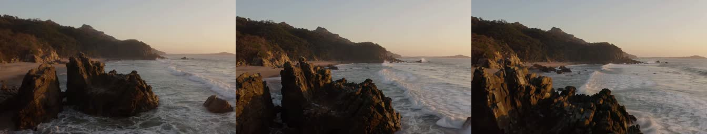

# H3 image-to-video: resident multimodal text encoder (GPU check)

Run date: 2026-09-28. This checks the change that keeps the H3 image-to-video
(FL2VA, and Ref2VA) text encoder resident, and `warmup = true` in the H3
serve configs.

| | |
|---|---|
| Pod | `xw436rol8zikj3` (`fv-i2v-0928194408`), Runpod SECURE, EU |
| GPU | RTX PRO 6000 Blackwell Server Edition, 96 GB |
| Image | `ghcr.io/zaitrarrio/fastvideo-rs-serve@sha256:f8470159…` (`sha-1ecb68f`) |
| Weights | EU network volume `jg48s6o1w0` at `/workspace`, read only |
| Config | `/etc/fv/runpod.toml` (h3-turbo, `i2v_encoder = "auto"`, `warmup = true`) |
| Lifetime | 1217 s at $2.09/hr = **$0.71**; deleted and verified (404) |
| Harness | `scripts/serve/e2e/pod.sh` (sidecar), `scripts/serve/fal-queue-smoke.sh`, `fv-gpucheck h3 i2v-parity` |
| Raw results | `artifacts/serve/e2e/i2v-resident/` |

Input for every I2V run: `scripts/gpu/fixtures/ti2v-beach-832x480.jpg` with
the prompt "Waves roll onto a rocky beach at sunset, sea foam swirling around
the dark rocks, as the camera slowly pushes in", seed 7, 5 s (124 frames).

## What changed

- The multimodal path's language model is the T2V text encoder (same
  Qwen3-VL checkpoint, layers 0..=49). It now runs on the resident decoder,
  and only the vision tower (1.09 GiB) plus the tokenizer are kept in
  addition.
- `[[models]] i2v_encoder = "auto" | "resident" | "stream"`:
  - `auto` (the default) is resident when the text encoder is resident and
    the free memory covers the vision tower plus the resident DiT plan.
    Otherwise it streams.
  - `resident` fails the load when there is no resident text encoder.
  - One startup line says which mode was chosen and why:
    `h3 i2v encoder: resident (71.5 GiB free covers the vision tower (2.0 GiB)
    and the resident plan (64.6 GiB)): vision tower 1.09 GiB loaded in 14.0 s`.
- The streamed path runs the language model at the resident encoder's
  precision. For FP8, the layers come from the pre-quantized
  `text_encoder_fp8/` tree. Resident and streamed runs therefore give the
  same bytes.
  - With no resident encoder (`text_encoder = "streamed"`, or a small card),
    the streamed path is the original bf16 one.
  - This changes the default output on large cards. Before, I2V text ran
    streamed bf16 while T2V ran resident FP8. Now I2V also runs FP8. The
    measured drift is below.
- A streamed multimodal forward asks the cancel token before the vision load
  and before each language-model layer. A cancelled request (for example, a
  stopped director session) stops within one layer instead of about 60-130 s.
- `warmup = true` runs one I2V job and one T2V job at the default canvas and
  length. Both go through the backend's own `generate` (MP4 encode included)
  before the model is reported ready. A warmup failure is logged; it does not
  stop the model from serving.

## Results

### Timing through the fal queue

`minimax/h3-turbo`. Wall time is measured from the client, through the
Runpod proxy.

| Job | Before (docs/serve/e2e/h3-turbo.md) | After: wall | After: fal `inference` |
|---|---|---|---|
| I2V 480P | 114 s (inference 7.8 s) | **16.4 s**, 15.6 s | 7.8 s |
| I2V 768P | 110-154 s (inference 21.8 s) | **33.1 s** | 21.6 s |
| T2V 768P, first job after ready | cold job 69.5 s vs 24.4 s warm (serverless, H100) | **30.0 s** | 18.8 s |
| T2V 768P, second job | | 29.7 s | 18.9 s |

- With warmup, the first job takes the same time as the second.
- The warmup took 60.3 s before readiness: I2V 1344x768x124 in 34.1 s and
  T2V in 26.3 s. Ready came 215 s after pod create, with the image already
  cached on the host.
- Model load took 144 s. That includes the text encoder from the FP8 tree
  (37.7 s I/O) and the vision tower (14.0 s, read from `text_encoder/`).

### Parity: `fv-gpucheck h3 i2v-parity`

The check runs 832x480x124 on the `4step-vsa` recipe with the resident FP8
encoder, all on one loaded pipeline:

| Run | Text stage | Wall | Output sha256 (124 PNG + WAV) |
|---|---|---|---|
| resident (first) | 0.68 s | 40.3 s | `a5f1102d…16bc8d8` |
| stream (vision + FP8 LM from the volume) | **51.2 s** | 89.9 s | `a5f1102d…16bc8d8` |
| resident | 0.60 s | 38.2 s | `a5f1102d…16bc8d8` |

**PASS**: 125 files, 0 differing between resident and stream.

These wall times include PNG writes, so they are longer than the serve wall
times above.

### Encoder only: `--text-only`

The same image and prompt, 422 tokens, looking at the multimodal hidden
states:

| Precision | Resident vs streamed (same precision) | Streamed | Resident (load / encode) |
|---|---|---|---|
| bf16 (the original streamed path) | **0 of 2 160 640 elements differ** | 131.5 s | 73.6 s / 0.92 s, 1.20 s |
| FP8 rows | **0 differ** | 50.9 s | 35.5 s / 0.87 s, 0.97 s |

- FP8 against the bf16 original: rel_l2 0.0203, cosine 0.99979. This is the
  same trade the resident FP8 T2V encoder already makes (E12).
- The 131 s bf16 streamed encode is the per-request cost that the E2E runs
  saw.

### Memory (serve, 1344x768x124 I2V)

- Weights live between jobs: 54.1 GiB. That is the text encoder at 22.7 GiB,
  the DiT non-linear parts at 23.9 GiB, the refiner, the VAEs, and the vision
  tower at 1.09 GiB, measured by the change in free memory.
- Denoise peak: 65.8 GiB of 96 GB.
- Under `fv-gpucheck` (no technique profile, f32 linears), the tower measured
  2.22 GiB and the 480p run peaked at 72.1 GiB.

## Not changed

- fal `timings` still reports only `inference` (the denoise). The text stage
  is in `JobMetrics.stage_durations["text"]`. Exposing it in the fal response
  belongs to the fal adapter (`crates/fastvideo-fal/src/queue.rs`).
